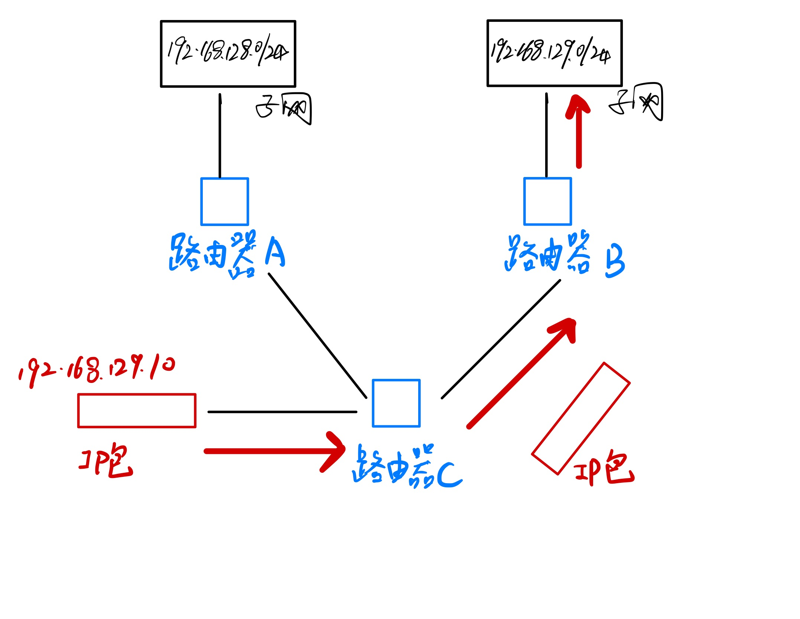
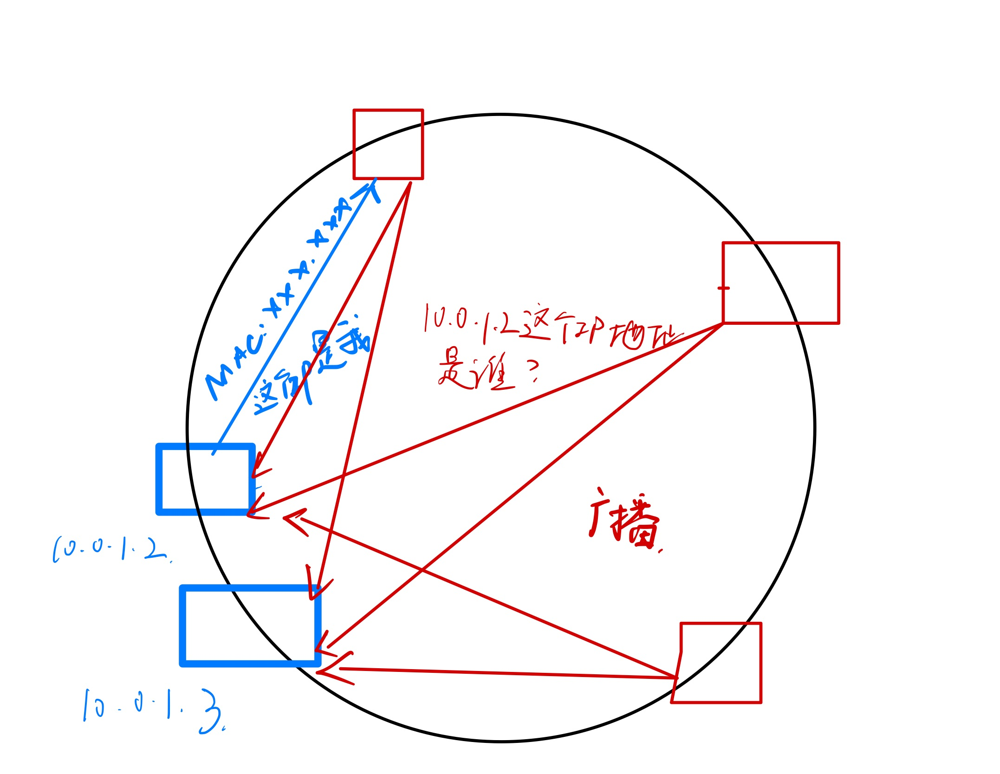

# 网络层

* [IP](#IP)
    * [IP地址](#IP地址)
    * [CIDR](#CIDR)
    * [ARP](#ARP)
    

## IP

### IP地址
* IP 地址(IPv4 地址)由32位正整数来表示。 方便记忆采用了 __点分十进制__ 的标记方式，也就是将32位IP地址以每8位为组，共分为 4 组，每组以 「 . 」隔开，再将每组转换成十进制。
* __点分十进制__: 192.168.1.1 __IPv4 二进制__: 11000000 10101000 00000001 00000001 

### CIDR

* IP分类存在许多缺点，所以后面提出了 __无分类地址__ 的方案，即 __CIDR__ 。 32比特的IP地址被划分为两部分，前面是网络号，后面是主机号。表示形式 a.b.c.d/x ，其中 /x 表示前 x 位属于网络号， x 的范围是0-32 ，这就使得 IP 地址更加具有灵活性。 10.100.122.2/24，这种地址表示形式就是 CIDR，/24 表示前24位是 __网络号__，剩余的8位是 __主机号__。

* 路由器的寻址工作，是通过网络号来转发包的，在子网内部，通过主机号来进一步将包送到目的地。

### 路由表
* __路由表__ 中记录着网络地址与下一步应该发送至路由器的地址。在主机和路由器上都会有各自的 __路由表__。
* 在发送IP包时，首先要确定IP包首部中的目标地址，再从路由控制表中找到与该地址具有相同 __网络号__ 的记录， 根据该记录将IP包转发给相应的下一个路由器。

### IP协议相关

### ARP
* 传输一个IP数据报的时候，确定了源IP地址和目标IP地址后，就会通过主机 __路由表__ 确定 IP 数据包下一跳。然而，网络层的下一层是数据链路层，所以我们还要知道「下一跳」的 __MAC__ 地址。

* 主机会通过广播发送ARP请求，这个包中包含了想要知道的MAC地址的主机 IP地址。当同个链路中的所有设备收到ARP请求时，会去拆开ARP请求包里的内容，如果ARP请求包中的目标IP地址与自己的IP地址一致，那么这个设备就将自己的MAC地址塞入ARP响应包返回给主机。

